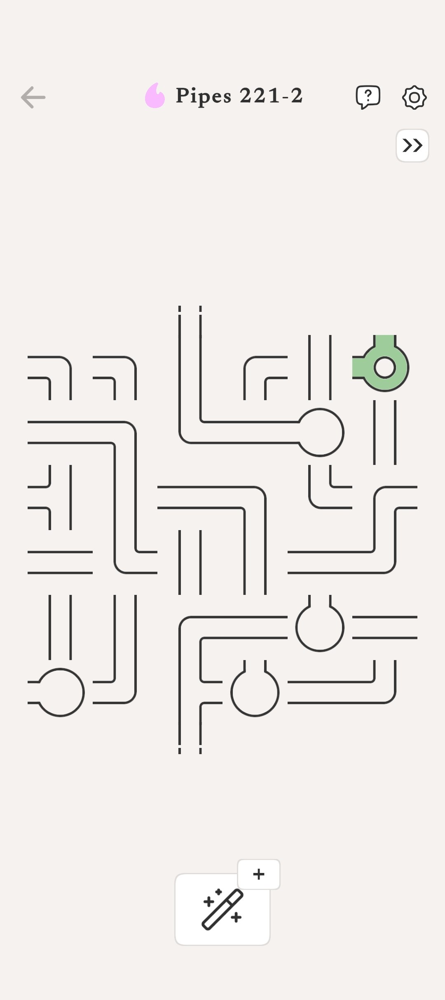

# 🎠 Palladius Vetrina — Giochi per Bimbi & Tool di Papà

> Vetrina interattiva e responsive per tutti i giochi creati per i bimbi (Tubature, Orologia.io, Puzzle, Pasta Invaders, ecc.) e i tool di sviluppo di Riccardo.



## ✨ Caratteristiche

- 🧸 **Discriminazione Chiara tra Giochi e Tool**: tab e filtri immediati per separare i giochi dedicati ai bimbi dai tool di sviluppo di papà.
- ⚡ **Ricerca Istantanea con Autofocus**: motore di ricerca client-side ultra-reattivo; basta digitare (es. `tetri`, `orolog`, `flutt`, `puzzle`) per filtrare in tempo reale titoli, descrizioni e tag.
- 🎮 **Grandi Screenshot Cliccabili**: zoom al passaggio del mouse e link diretto al gioco live su GitHub Pages.
- 📝 **Single Source of Truth in YAML**: tutti i dati sono registrati e modificabili semplicemente in `data/games.yaml`.
- 🚀 **Zero Dipendenze Runtime**: HTML5, TailwindCSS e Vanilla JS, pronto per essere servito staticamente su GitHub Pages.

## 🛠️ Come aggiungere o modificare un gioco

1. Apri `data/games.yaml`.
2. Aggiungi o modifica una voce:
   ```yaml
   - id: "mio-gioco"
     title: "Nome del Gioco"
     category: "kids" # oppure "tools"
     tagline: "Breve sottotitolo accattivante"
     description: "Descrizione completa"
     screenshot: "assets/screenshots/mio-gioco.png"
     play_url: "https://palladius.github.io/mio-gioco/"
     repo_url: "https://github.com/palladius/mio-gioco"
     tech: ["Flutter", "Dart"]
     tags: ["puzzle", "bimbi"]
     badge: "🟢 Gioca Live"
     target: "Alessandro & Sebi"
   ```
3. Esegui la sincronizzazione:
   ```bash
   just build
   # oppure:
   ./bin/build.py
   ```

## 💻 Esecuzione in Locale

```bash
just serve
# oppure:
python3 -m http.server 8080
```
Apri poi il browser all'indirizzo [http://localhost:8080](http://localhost:8080).
